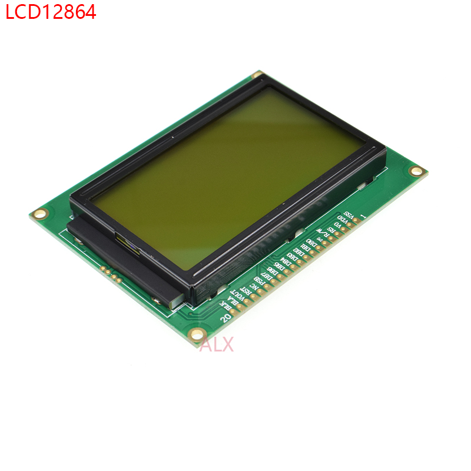

# ArduinoLibrary_LCD12864Serial

#### 介绍

    LCD12864带中文字库驱动  适用ARDUINO平台

    软件模拟spi，可定义任意一引脚。
    仅支持串行模式（节省引脚，仅需三个引脚即可）。
    只支持软件给12864复位，没有配置复位引脚。


#### 适用硬件

使用ST7920芯片的12864，需要短接JP2焊盘中的S。


#### 软件架构

    通过构造函数指定12864使用的三个引脚


#### 安装教程

1.  将发行版解压到Arduino安装目录中的libraries目录中。（可选）


#### 使用说明

1.  使用"安装教程"中的方式进行安装，并使用#include <lcd12864b_s.h>进行引入
2.  将代码复制到工程中，并使用#include "lcd12864b_s.h"进行引入

#### 示例代码
在arduino中：
```
#include "lcd12864b_s.h"
LCD12864B_S lcd(PA4,PA5,PA6);
void setup() {
    lcd.init();
    lcd.printfxy(0,0,"hello,%s","world");
    delay(2000);
    lcd.cls();
    lcd.printfxy(0,1,"hello,%s","wrold");
}
```


